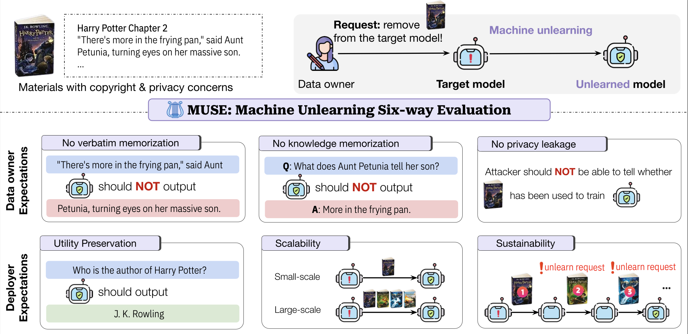

#  MUSE: Machine Unlearning Six-Way Evaluation for Language Models

This repository provides the original implementation of *Machine Unlearning Six-Way Evaluation for Language Models* by Weijia Shi*, Jaechan Lee*, Yangsibo Huang*, Sadhika Malladi, Jieyu Zhao, Ari Holtzman, Daogao Liu, Luke Zettlemoyer, Noah A. Smith, and Chiyuan Zhang. (*Equal contribution)


[Website](https://muse-bench.github.io/) |  [Leaderboard](https://huggingface.co/spaces/chan030609/muse_leaderboard) | [MUSE-News Benchmark](https://huggingface.co/datasets/muse-bench/MUSE-News) | [MUSE-News Benchmark](https://huggingface.co/datasets/muse-bench/MUSE-News) |  [MUSE-Books Benchmark](https://huggingface.co/datasets/muse-bench/MUSE-Books) 


## Overview
**MUSE** is a comprehensive machine unlearning evaluation benchmark that assesses six desirable properties for unlearned models: (1) no verbatim memorization, (2) no knowledge memorization, (3) no privacy leakage, (4) utility preservation for non-removed data, (5) scalability with respect to removal requests, and (6) sustainability over sequential unlearning requests.

<p align="center">
  
</p>


:star: If you find our implementation and paper helpful, please consider citing our work :star: :

```bibtex
@misc{shi2023detecting,
    title={Detecting Pretraining Data from Large Language Models},
    author={Weijia Shi and Anirudh Ajith and Mengzhou Xia and Yangsibo Huang and Daogao Liu and Terra Blevins and Danqi Chen and Luke Zettlemoyer},
    year={2023},
    eprint={2310.16789},
    archivePrefix={arXiv},
    primaryClass={cs.CL}
}
```

## Content
- [🛠️ Installation](#🛠️-installation)
- [📘 Data & Target Models](#📘-data--target-models)
- [🚀 Run Unlearning Baselines](#🚀-run-unlearning-baselines)
- [🔍 Evaluation of Unlearned Models](#🔍-evaluation-of-unlearned-models)
    - [Knowledge Memorization (C2)](#evaluate-the-knowledge-memorization-c2-and-identify-unlearned-checkpoints-with-optimal-forget-qualities)
    - [Verbatim Memorization (C1)](#evaluate-verbatim-memorization-c1)
    - [Privacy Leakage (C3)](#evaluate-privacy-leakage-c3)
    - [Scalability and Sustainability (C4 & C5)](#evaluate-scalability-and-sustainability)
- [➕ Add to the Leaderboard](#➕-add-to-the-leaderboard)

## 🛠️ Installation

### Conda Environment

To create a conda environment for Python 3.10, run:
```bash
conda env create -f environment.yml
conda activate py310
```

## 📘 Data & Target Models
### Data
Data is located in the `data` folder at the root of this repo. (Change this!!!)

| Domain | <div style="text-align: center">Target Model for Unlearning</div> | Dataset |
|----------|:------------------------------:|----------| 
| Books | [Target model](https://huggingface.co/muse-bench/MUSE-Books_target) | [Dataset](https://huggingface.co/datasets/muse-bench/MUSE-Books) | 
| News | [Target model](https://huggingface.co/muse-bench/MUSE-News_target) | [Dataset](https://huggingface.co/datasets/muse-bench/MUSE-News) |


## 🚀 Run unlearning baselines

To unlearn the target model using our baseline method, run `unlearn.py` in the `baselines` folder. Example scripts `baselines/scripts/unlearn_bbc.sh` and `scripts/unlearn_hp.sh` in the `baselines` folder demonstrate the usage of `unlearn.py`. Here is an example:
```bash
algo="ga"
CORPUS="bbc"

python unlearn.py \
        --algo $algo \
        --model_dir $TARGET_DIR --tokenizer_dir 'meta-llama/Llama-2-7b-hf' \
        --data_file $FORGET --retain_data_file $RETAIN \
        --out_dir "./ckpt/$CORPUS/$algo" \
        --max_len $MAX_LEN --epochs $EPOCHS --lr $LR \
        --per_device_batch_size $PER_DEVICE_BATCH_SIZE
```

- `algo`: Unlearning algorithm to run (`ga`, `ga_gdr`, `ga_klr`, `npo`, `npo_gdr`, `npo_klr`, or `tv`).
- `model_dir`: Directory of the target model.
- `tokenizer_dir`: Directory of the tokenizer.
- `data_file`: Forget set.
- `retain_data_file`: Retain set for GDR/KLR regularizations if required by the algorithm.
- `out_dir`: Directory to save the unlearned model (default: `ckpt`).
- `max_len`: Maximum input length (default: 2048).
- `per_device_batch_size`, `epochs`, `lr`: Hyperparameters.

----
**Resulting models are saved in the `ckpt` folder as shown:**
```
ckpt
├── bbc/
│   ├── ga/
│   │   ├── checkpoint-102
│   │   ├── checkpoint-204
│   │   ├── checkpoint-306
│   │   └── ...
│   └── npo/
│       └── ...
└── hp/
    ├── ga
    └── ...
```
# 🔍 Evaluation of Unlearned Models
### Evaluate the Knowledge Memorization (C2) and Identify the Unlearned Checkpoints with Optimal Forget Qualities

The unlearning process above yields multiple model checkpoints, each with a different degree of unlearning. For iterative methods like `ga` and `npo`, the number of gradient update steps controls the degree of unlearning. For model editing methods like `tv` and `whp`, a hyperparameter $\alpha$ controls this degree. Running the following script selects a single checkpoint for each unlearning algorithm, an optimal one up to our stopping criteria:
```
cd knowmem
python ./scripts/get_best_forget_quality.py --corpus [CORPUS]
```
where `[CORPUS]` is either `bbc` or `hp`.

In `get_best_forget_quality.py`, we evaluate on the forget set the knowledge memorization of the target model, the retrained model, and given checkpoints of an unlearning algorithm in order to determine the first checkpoint (a checkpoint with the lowest degree of unlearning, i.e. the lowest number of epochs for `GA`/`NPO` variants and the lowest $\alpha$ for `TV` and `WHP`) to achieve a memorization score less than or equal to that of the retrained model. __The only bash argument you need to specify is `--corpus bbc` or `--corpus hp` if you have been following our setup with a goal to reproduce our experiment results.__ The output files are stored inside the folder `knowmem/out` as follows:

```
knowmem/out
├── bbc/
│   ├── ga/
│   │   └── step=102/
│   │       └── forget/
│   │           ├── history.json
│   │           └── out.json
│   ├── npo/
│   │   ├── step=102/
│   │   │   └── forget/
│   │   │       ├── history.json
│   │   │       └── out.json
│   │   ├── step=204/
│   │   │   └── ...
│   │   ├── ...
│   │   └── step=714/
│   │       └── forget/
│   │           ├── history.json
│   │           └── out.json
│   └── whp/
│       ├── alpha=1/
│       │   └── forget/
│       │       ├── history.json
│       │       └── out.json
│       └── ...
└── hp/
    └── ...
```
`history.json` contains the unlearned model's response to each QA pair and its Rouge scores with respect to the gold answer. `out.json` contains aggregate statistics for these Rouge scores.

In the example output structure above, observe that `ga` only has one epoch (`step=102`) evaluated, whereas `ga_gdr` has seven. This is because we stop evaluating a given algorithm for later checkpoints and move onto the next algorithm if we find that an earlier checkpoint already achieves a forget quality less than or equal to that of the retrained model.

Other parameters for `get_best_forget_quality.py` include:
- `--algos`: List of unlearning algorithms to evaluate.
- `--ckpt_dir`: Directory containing model checkpoints (default: `ckpt` folder).
- `--target_model_dir`: Directory of the target model.
- `--retrain_model_dir`: Directory of the retrained model.
- `--reinforced_model_dir`: Directory of the reinforced model.
- `--step_algos`: Algorithms controlled by the number of unlearning steps.
- `--alpha_algos`: Algorithms controlled by the hyperparameter α.
- `--steps`: Steps to evaluate for each algorithm in `step_algos`.
- `--alphas`: α values to evaluate for each algorithm in `alpha_algos`.
- `--metric`: Evaluation metric (default: `mean_rougeL`).
- `--max_new_tokens`: Maximum number of new tokens to decode.
- `--qa_file`: Path to JSON file with QA pairs for evaluation.
- `--icl_file`: Path to JSON file with QA pairs for in-context learning.

> If you find the expected folder structure of `get_best_forget_quality.py` for input (`ckpt`) and output (`knowmem/out`) too restrictive, see the `main` function inside `./knowmem/get_rouge_qa.py`, which we internally call and relaxes the I/O by accepting any unlearned checkpoint directory as an input and returning Python dictionaries that contain the output.

### Evaluate Verbatim Memorization (C1)

To evaluate C1, run:
```
cd verbmem
python ./scripts/get_memorization.py --corpus [CORPUS] --ckpt_names [CKPT_NAMES]
```
where `CKPT_NAMES` includes algorithm names and their specific checkpoints chosen earlier (e.g., `ga/step=102` or `whp/alpha=2`). Output files are stored in `./verbmem/out`:
```
verbmem/out
├── bbc/
│   ├── ga/
│   │   └── step=102/
│   │       └── forget/
│   │           ├── history.json
│   │           └── out.json
│   ├── whp/
│   │   └── alpha=1/
│   │       └── forget/
│   │           ├── history.json
│   │           └── out.json
│   └── ...
└── hp/
    └── ...
```
Other parameters include:
- `--data_file`: JSON file with "prompt" and "gt" fields (default: `./data/[CORPUS]/verbmem/bbc.json`).
- `--target_model_dir`, `--retrain_model_dir`, `--reinforced_model_dir`, `--max_new_tokens`, `--tokenizer_dir`, `--step_algos`, `--alpha_algos`, `--ckpt_dir` play the same role as before.

> For more customized I/O, see the `main` function implemented in `verbmem/get_rouge.py`.

### Evaluate Privacy Leakage (C3)

To evaluate C3, run:
```
cd privleak
python ./scripts/get_ppl.py --corpus [CORPUS] --ckpt_names [CKPT_NAMES]
```
`get_ppl.py` computes various MIA scores (e.g., PPL, PPL/zlib, Min-40%) for each sample in the forget, retain, and holdout sets. Output files are stored in `privleak/out`.
```
privleak/out
├── bbc/
│   ├── ga/
│   │   └── step=102/
│   │       ├── forget.json
│   │       ├── retain2.json
│   │       ├── holdout.json
│   │       └── auc.json
│   └── ...
└── hp/
    └── ...
```
Other parameters include:
- `--forget_file`, `--retain_file`, `--holdout_file`: Paths to JSON files for forget, retain, and holdout sets (default: `data/[CORPUS]/privleak`).
- `--ckpt_dir`, `--tokenizer_dir`, `--target_model_dir`, `--retrain_model_dir`, `--step_algos`, `--alpha_algos` play the same roles as before.

> For more customized I/O, see the `main` function implemented in `privleak/get_ppl_utils.py`.

### Evaluate Utility Preservation (C4)

To evaluate C4, run:
```
cd knowmem
python ./scripts/get_utility.py --corpus [CORPUS] --ckpt_names [CKPT_NAMES]
```
Output files are stored in `knowmem/out`:
```
knowmem/out
├── bbc/
│   ├── ga/
│   │   └── step=102/
│   │       └── retain/
│   │           ├── history.json
│   │           └── out.json
│   └── ...
└── hp/
    └── ...
```
Other parameters include: `step_algos`, `alpha_algos`, `ckpt_dir`, `metric`, `max_new_tokens`, `qa_file`, `icl_file`, `target_model_dir`, `retrain_model_dir`, `reinforced_model_dir`, `tokenizer_dir`, which play the same roles as before.

> For more customized I/O, see the `main` function implemented in `knowmem/get_rouge_qa.py`.

### Evaluate Scalability and Sustainability

Example scripts `baselines/scripts/unlearn_bbc_scal.sh` and `baselines/scripts/unlearn_bbc_sust.sh` demonstrate unlearning for scalability and sustainability setups. The unlearned models for the folds 2, 3, and 4 (fold 1 is precisely the original forget set `data/raw/forget.json`) are expected to be stored in `ckpt`:
```
ckpt
└── bbc/
    ├── scal/
    │   ├── ga/
    │   │   ├── 2/
    │   │   │   ├── checkpoint-102
    │   │   │   └── ...
    │   │   ├── 3
    │   │   └── 4
    │   └── ga_gdr/
    │       ├── 2
    │       └── ...
    └── sust/
        └── ...
```

To evaluate the model utilities of the unlearned models, run:
```
cd knowmem
python ./get_utility_scal_sust --corpus bbc --mode [MODE]
```
where `MODE` is either `scal` (scalability) or `sust` (sustainability). Output files are stored in `knowmem/out`:
```
knowmem/out
└── bbc/
    └── scal/
        ├── ga/
        │   ├── 1/
        │   │   └── retain/
        │   │       ├── history.json
        │   │       └── out.json
        │   ├── 2
        │   ├── 3
        │   └── 4
        └── ...
```
## ➕ Add to the Leaderboard
